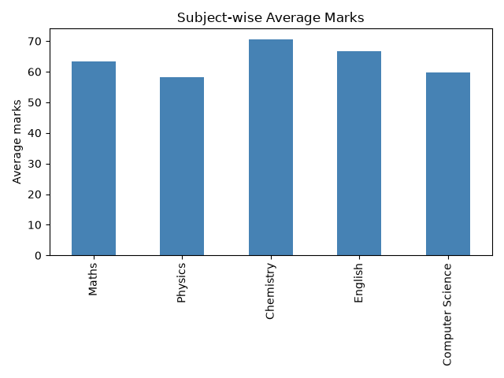
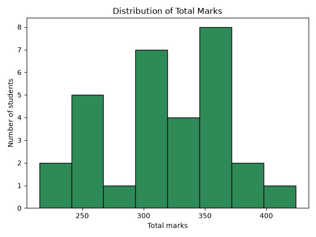

# Student Marks Analyzer

A beginner data analysis project using Python, NumPy, pandas and matplotlib.
It analyses the marks of 30 students across 5 subjects.

## What it does
- Generates sample marks data with NumPy and saves it as `marks.csv`
- Loads the data with pandas and checks for missing values
- Calculates Total, Average, Pass/Fail result and Rank for each student
- Finds the top 5 students, subject-wise averages and subject toppers
- Calculates the overall pass percentage
- Plots charts with matplotlib
- Saves the final table as `results.csv`

## Tech used
Python, NumPy, pandas, matplotlib, Jupyter Notebook

## Charts

## How to run
1. Install the libraries: `pip install pandas numpy matplotlib notebook`
2. Run `jupyter notebook` and open `student_marks(numpy-pands).ipynb`
3. Click Kernel > Restart & Run All

## Note
The marks data is randomly generated sample data, not real student data.
